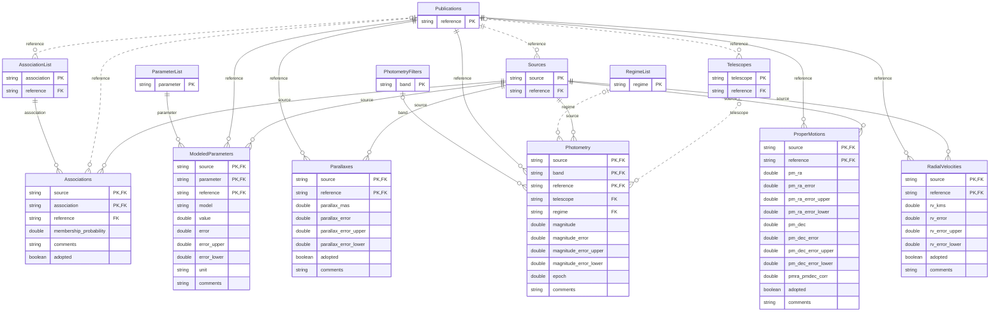

# Data tables

<!-- ERD:BEGIN - generated by astrodb-build-07-erd; edit schema.yaml, not this block -->

```mermaid
erDiagram
    AssociationList ||--o{ Associations : "association"
    ParameterList ||--o{ ModeledParameters : "parameter"
    PhotometryFilters |o--o{ Photometry : "band"
    Publications |o..o{ AssociationList : "reference"
    Publications ||..o{ Associations : "reference"
    Publications ||--o{ ModeledParameters : "reference"
    Publications ||--o{ Parallaxes : "reference"
    Publications ||--o{ Photometry : "reference"
    Publications ||--o{ ProperMotions : "reference"
    Publications ||--o{ RadialVelocities : "reference"
    Publications ||..o{ Sources : "reference"
    Publications |o..o{ Telescopes : "reference"
    RegimeList |o..o{ Photometry : "regime"
    Sources ||--o{ Associations : "source"
    Sources ||--o{ ModeledParameters : "source"
    Sources ||--o{ Parallaxes : "source"
    Sources ||--o{ Photometry : "source"
    Sources ||--o{ ProperMotions : "source"
    Sources ||--o{ RadialVelocities : "source"
    Telescopes |o..o{ Photometry : "telescope"
    Photometry {
        string source PK, FK
        string band PK, FK
        string reference PK, FK
        string telescope FK
        string regime FK
        double magnitude
        double magnitude_error
        double magnitude_error_upper
        double magnitude_error_lower
        double epoch
        string comments
    }
    Parallaxes {
        string source PK, FK
        string reference PK, FK
        double parallax_mas
        double parallax_error
        double parallax_error_upper
        double parallax_error_lower
        boolean adopted
        string comments
    }
    RadialVelocities {
        string source PK, FK
        string reference PK, FK
        double rv_kms
        double rv_error
        double rv_error_upper
        double rv_error_lower
        boolean adopted
        string comments
    }
    Associations {
        string source PK, FK
        string association PK, FK
        string reference FK
        double membership_probability
        string comments
        boolean adopted
    }
    ProperMotions {
        string source PK, FK
        string reference PK, FK
        double pm_ra
        double pm_ra_error
        double pm_ra_error_upper
        double pm_ra_error_lower
        double pm_dec
        double pm_dec_error
        double pm_dec_error_upper
        double pm_dec_error_lower
        double pmra_pmdec_corr
        boolean adopted
        string comments
    }
    ModeledParameters {
        string source PK, FK
        string parameter PK, FK
        string reference PK, FK
        string model
        double value
        double error
        double error_upper
        double error_lower
        string unit
        string comments
    }
    Publications {
        string reference PK
    }
    Telescopes {
        string telescope PK
        string reference FK
    }
    PhotometryFilters {
        string band PK
    }
    RegimeList {
        string regime PK
    }
    AssociationList {
        string association PK
        string reference FK
    }
    ParameterList {
        string parameter PK
    }
    Sources {
        string source PK
        string reference FK
    }
```
<!-- ERD:END -->
